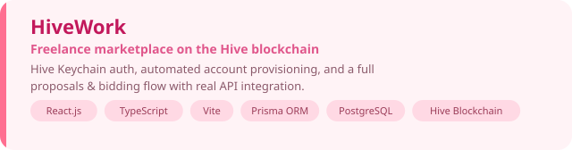
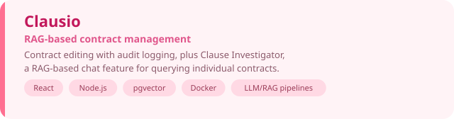
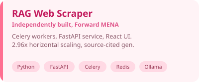
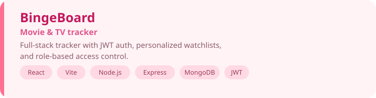
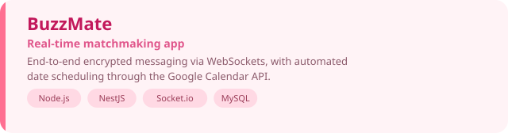

<!-- SOFT HEADER — gradient strip with a small, quiet name -->

<!-- TYPING TAGLINE -->

 

<!-- ROLE PILLS -->

  

<h3>🩷 Tech Stack</h3>

 

 

  

## 🌸 About Me

Computer Science student at LAU, building full-stack applications and researching trustworthy AI. Most of my work sits at the intersection of the two: retrieval-augmented systems, NLP pipelines, and the infrastructure that holds them together.

🔭 Currently building **HiveWork** (freelance marketplace on the Hive blockchain) and **Clausio** (RAG-based contract management)
 
📚 Recently wrapped **EFS**, an NLP metric for detecting semantic distortion in LLM-generated text
 
🌱 Currently learning **French**, one Duolingo streak at a time
 
💌 Reach me at **harfoushleen@gmail.com**

 

## 🎀 Featured Projects

<table>
<tr>
<td width="50%"></td>
<td width="50%"></td>
</tr>
<tr>
<td width="50%"></td>
<td width="50%"></td>
</tr>
<tr>
<td width="50%"></td>
<td width="50%"></td>
</tr>
</table>

  

## 🌷 GitHub Stats

 

  

## 🍬 Let's Connect

  

